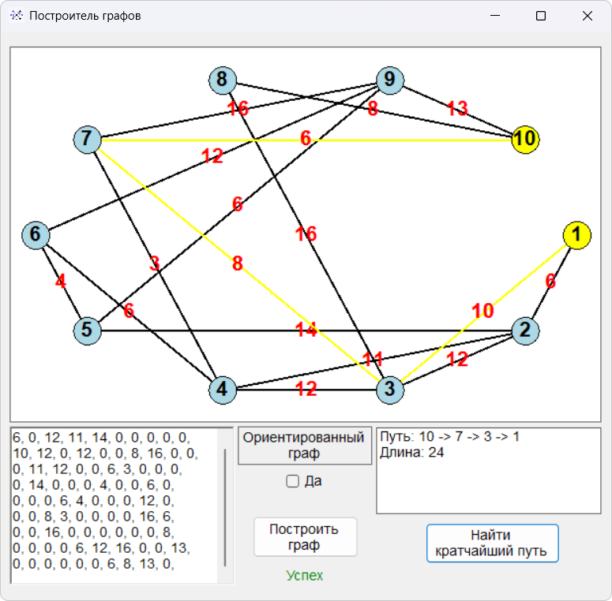

# Graph Builder - Приложение для построения и анализа графов

## Возможности и функциональность

- **Визуализация графов** по матрице смежности/весов
- **Поддержка типов графов**: ориентированные и неориентированные
- **Поиск кратчайшего пути** между вершинами (алгоритм Дейкстры)
- **Интерактивный интерфейс**: выбор вершин кликом мыши
- **Эллипсовая расстановка** вершин для оптимального отображения

## Технологии

- .NET Framework 4.8
- Windows Forms
- C#
